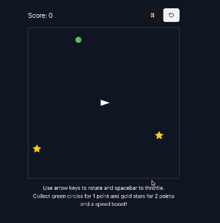

# 🚀 Rocketshipper

A modern, browser-based 2D game built with Next.js and TypeScript, showcasing real-time physics simulation and interactive gameplay.

[](https://www.typescriptlang.org/)
[](https://nextjs.org/)
[](https://tailwindcss.com/)
[](https://reactjs.org/)



## 🎮 Game Features

- **Real-time Physics Engine**

  - Smooth inertia-based movement system
  - Precise collision detection
  - Realistic thrust and rotation mechanics
  - Boundary management for game area

- **Particle System**

  - Dynamic thrust particles
  - Explosion effects on target collision
  - Visual feedback for player actions

- **Game Mechanics**
  - Score tracking system
  - Special power-ups (speed boost from stars)
  - Multiple target types with different rewards
  - Pause/Resume/Reset functionality

## 🛠️ Technical Highlights

- **Modern Tech Stack**

  - Next.js 14 for optimal performance and routing
  - React 18 with functional components and hooks
  - TypeScript for type safety and better developer experience
  - HTML5 Canvas for efficient game rendering
  - Tailwind CSS for responsive design
  - shadcn/ui for polished UI components

- **Architecture & Design**

  - Custom React hooks for game logic abstraction
  - Efficient game loop using requestAnimationFrame
  - Component-based architecture
  - State management using React hooks
  - Responsive layout with Flexbox

- **Performance Optimizations**
  - Delta time calculations for smooth animations
  - Optimized rendering with canvas
  - Efficient collision detection algorithms
  - Careful management of re-renders

## 🚀 Quick Start

1. Clone the repository:

   ```bash
   git clone https://github.com/atreib/rocketshipper.git
   cd rocketshipper
   ```

2. Install dependencies:

   ```bash
   npm install
   # or
   yarn install
   # or
   pnpm install
   ```

3. Run the development server:

   ```bash
   npm run dev
   # or
   yarn dev
   # or
   pnpm dev
   ```

4. Open [http://localhost:3000](http://localhost:3000) in your browser

## 🎮 Game Controls

- **Arrow Keys**: Rotate the rocket
- **Spacebar**: Apply thrust
- **P**: Pause/Resume game
- **R**: Reset game

## 🧪 Technical Implementation Details

The game demonstrates several key technical concepts:

- **Custom Hook System**

  - `useKeyPress`: Manages keyboard input state
  - `useParticles`: Handles particle system logic
  - Efficient state management with `useState` and `useCallback`

- **Physics Implementation**

  - Vector-based movement calculations
  - Frame-rate independent physics using delta time
  - Optimized collision detection algorithms

- **Rendering Pipeline**
  - Double buffering for smooth animations
  - Efficient canvas clearing and redrawing
  - Particle system optimization

---

Built with 💻 by [André Treib](https://www.andretreib.com/) - A demonstration of modern web development practices
